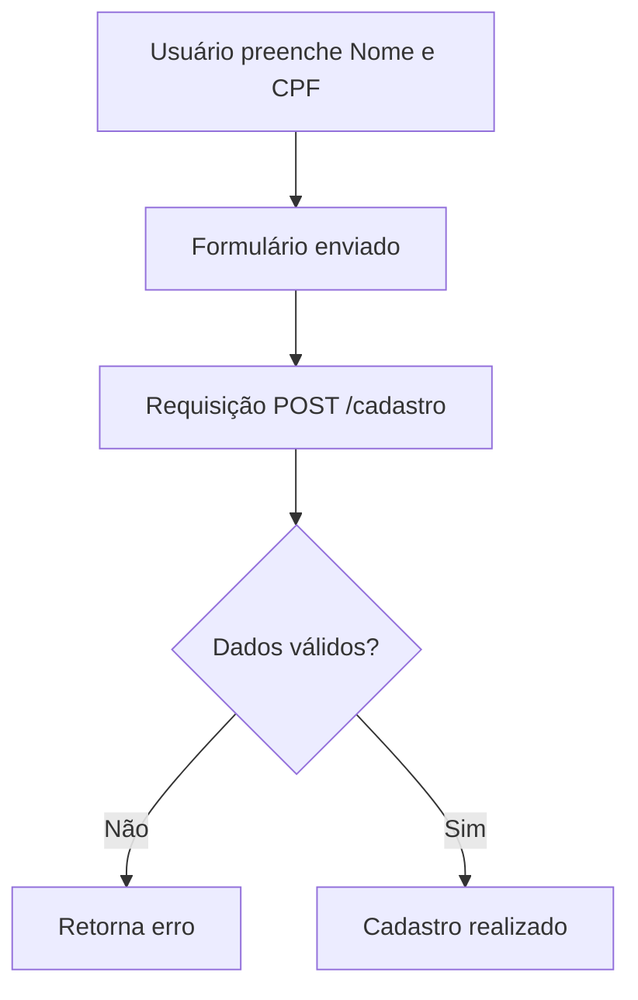

# 🏥 Cadastro de Pacientes

Projeto desenvolvido para praticar conceitos de desenvolvimento web, integração entre frontend e backend e validação de dados utilizando JavaScript.

## 📋 Funcionalidades

- Cadastro de pacientes
- Inserção de Nome e CPF
- Envio de dados para o servidor utilizando Fetch API
- Validação de campos obrigatórios
- Verificação do tamanho do CPF
- Retorno de mensagens de erro e sucesso

## 🛠️ Tecnologias Utilizadas

<p align="left">
  
</p>

## 📂 Estrutura do Projeto

```bash
📁 projeto
│
├── index.html
├── style.css
├── script.js
└── validar.js
```

## 🚀 Como Executar

```bash
# Clone o repositório
git clone https://github.com/seu-usuario/seu-repositorio.git

# Entre na pasta
cd seu-repositorio

# Instale as dependências
npm install

# Inicie o servidor
npm start
```

## 📖 Fluxo da Aplicação



## 🔒 Validações

- Nome obrigatório
- CPF obrigatório
- CPF deve possuir 11 caracteres

## 💻 Exemplo de Requisição

```json
{
  "nome": "João Silva",
  "cpf": "12345678901"
}
```

## 📌 Objetivo do Projeto

Este projeto foi desenvolvido para praticar:

- Manipulação do DOM
- Eventos de formulário
- Requisições HTTP
- Middleware de validação
- Integração Frontend e Backend

## 👨‍💻 Autor

**Bruno Vinícius**

🎓 Estudante de Desenvolvimento Web e Cibersegurança

---

⭐ Se este projeto foi útil para você, considere deixar uma estrela no repositório.
